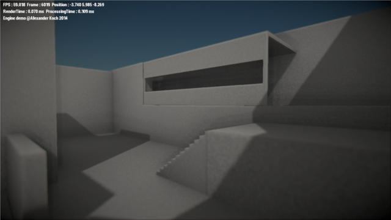
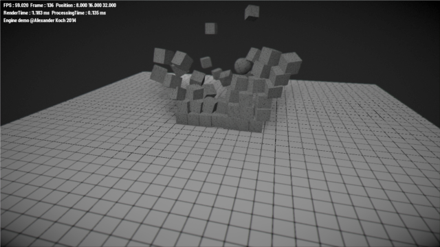

# 3D Game Engine

A Game Engine written in C++11 with an embedded Lua interpreter.

The project was used in the German science competition "Jugend forscht" 2015.

## Features:

- Bullet physics
- Simple scene graph rendering system
- Lua for scripting and project files
- Wavefront OBJ mesh loading
- PNG and TGA image files loading
- Text rendering using Freetype

## 1. Scripting and projects

### Project structure

A project consists of a toplevel directory with the projects name and subfolders for the contents.
You can generate one by using the Frontend-Editor - FrontEd.

	project
	|
	|-- levels
	|-- meshes
	|-- scripts
	|	|-- main.lua
	|	`-- main.mat
	|
	|-- shaders
	|-- sounds
	`-- project.vproj

Also a project file (*.vproj) is needed. An example project file
could look like this:
```lua
project = {
	name = "Game",
	script = "scripts/main.lua"
}
```

The name attribute is shown in the window title, the script is the initial script.

### Scripting

The main script has three different function for you to use. Below is a basic file shown.

```lua
scene = Scene()

function onInit()
	-- Your initialisation method
end

function onUpdate()
	-- The update method is called once per frame
end

function onDraw()
	-- Debug drawing
end
```

The scene variable lets you access the whole scene and modify it. For example you can add an object in the onInit method(),
save it in a global variable and move it in update by applying a force on it. Vectors are represented by a table e.g. {1,3,5} -
a three-dimensional vector with x=1, y=3, z=5.

If you want to declare your own class, you can use the method class().
The constructor is declared by the __init() method.
Example:

```lua
Sky = class()

function Sky:__init()
	self.color = 0xFF00FF
end

function Sky:render()
	--do some stuff here
end
```

Other scripts can be imported / included using the 'include'-function.
```lua
include("scripts/your/file/here.lua")
```

### Materials

Materials are created using GLSL-Shaders and a *.mat file.
Every material file has three different entries: textures, cubemaps and materials.
The file is formatted as a Lua file.

Here is an example:
```lua
textures = {
	lightmap = "maps/bake.png",
	box = "maps/box.png",
}

cubemaps = {
	cube0 = {
		posX = "maps/cubemap2/pos-x.png",
		negX = "maps/cubemap2/neg-x.png",
		posY = "maps/cubemap2/pos-y.png",
		negY = "maps/cubemap2/neg-y.png",
		posZ = "maps/cubemap2/pos-z.png",
		negZ = "maps/cubemap2/neg-z.png"
	}
}

materials = {
	ground = {
		shader = "shaders/ground",
		turbidity = 2.0,
		rayleighCoefficient = 2.5,
		mieCoefficient = 0.01,
		mieDirectionalG = 0.80,
		hasShadowMap = 0,
		sunDirection = {0.836, 0.091, -0.54},
		textured = 1,
		_texture = "lightmap"
	},
	[...]
```

### Engine configuration

The Engine is configured using the engine.properties file.
This file is in a similar file format to java's properties files and
decides how and what the engine should run.
The window size and other internal properties can be set.
Important for the scripting is that you have to set the path of the current project
inside this file. Otherwise the engine will try to load the predefined project.

Example config:
```ruby
# Context settings
width = 1920
height = 1080
fullscreen = 0

# Project file
project = demos/physics/bullet.vproj
```


## 2. Tech-Demos

The following tech-demos are available:

- a_star - The A*-Pathfinding algorithm
- dungeon - A pseudo-random dungeon structure
- game - A 3D Fist-person simulation
- physics - Use bullet physics to break a wall

### Screenshots





## 3. Front-End

The frontend is created using [imgui](https://github.com/ocornut/imgui) and is still in development.
It is a WYSIWYG-Editor with a 3D-Scene-View. Objects can be placed and materials can be loaded.

## 4. For Developers

The project is compiled using a Makefile and uses MinGW (GNU GCC).
To compile the project you have to download and install the dependencies for your system.
For the dependencies you need to have CMake installed.

	$ mkdir build
	$ make

All the dependencies/third-party-libraries should be placed in the libs-folder.

**Dependencies**

* [Bullet](http://bulletphysics.org/) - zlib
* [Freetype](http://www.freetype.org/) - FTL BSD
* [GLEW](http://glew.sourceforge.net/) - GLEW BSD
* [GLFW](http://www.glfw.org/) - zlib/libpng
* [GLM](http://glm.g-truc.net/0.9.6/index.html) - MIT
* [lodepng](http://lodev.org/lodepng/) - lodepng
* [Lua](http://www.lua.org/) - MIT
* [imgui](https://github.com/ocornut/imgui) - MIT
* [tinyobjloader](https://github.com/syoyo/tinyobjloader) - 2 clause BSD

## License

Copyright (c) 2014-2015 Alexander Koch

Licensed under the Apache License, Version 2.0 (the "License");

You may obtain a copy of the License at

http://www.apache.org/licenses/LICENSE-2.0

Unless required by applicable law or agreed to in writing, software
distributed under the License is distributed on an "AS IS" BASIS,
WITHOUT WARRANTIES OR CONDITIONS OF ANY KIND, either express or implied.
See the License for the specific language governing permissions and
limitations under the License.
